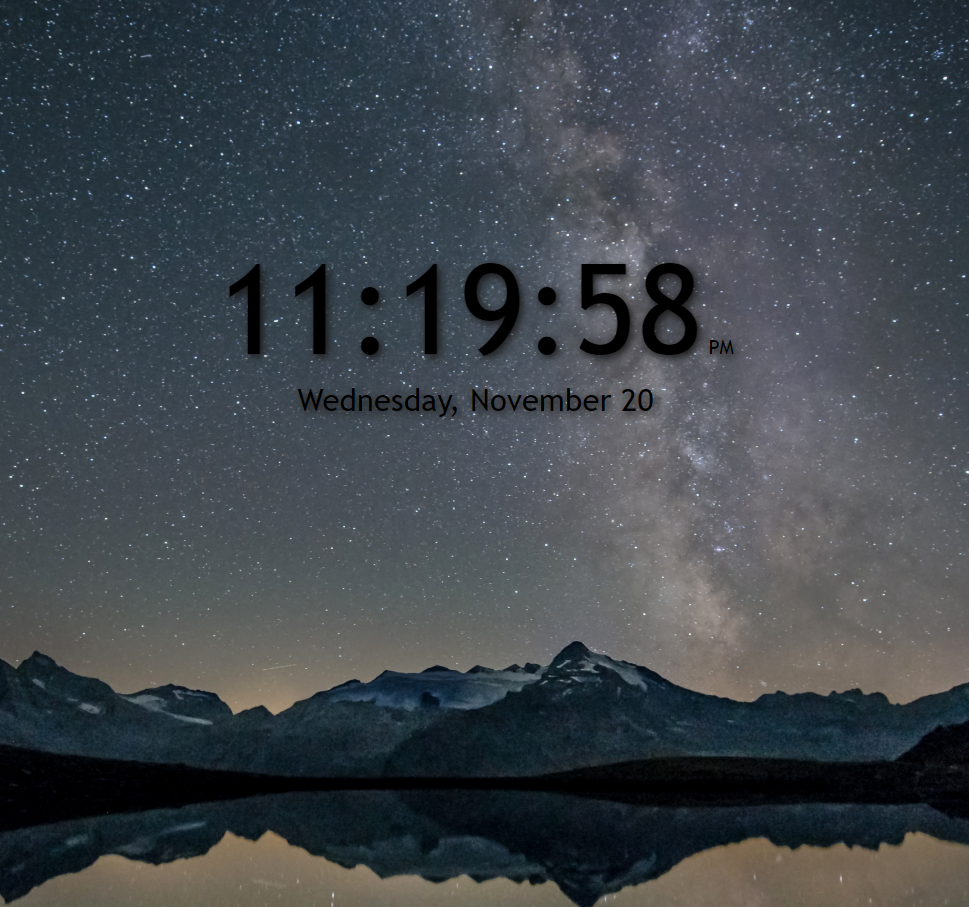

 # Digital Clock

### Use this Digital Clock to keep from losing track of time during work or play on your computer!   
## Link to working application:  [Digital Clock](https://rfussell17.github.io/DigitalClock-JS/)
 

 

#  Summary
### This is my Digital Clock project that is built with HTML, CSS and vanilla JS. No Libraries or Frameworks were used.

## Author
### Robin Fussell
