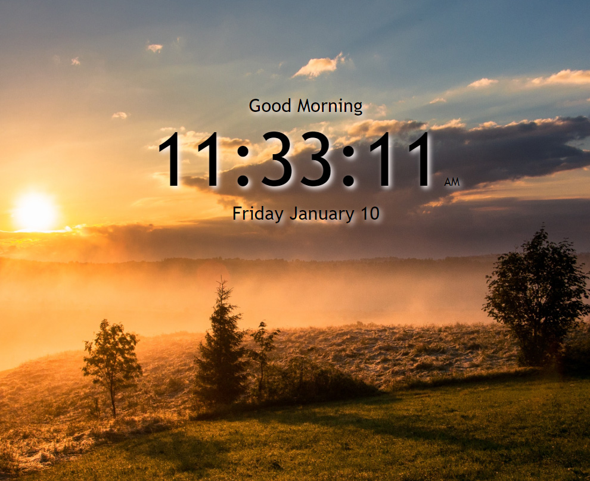

 ## Digital Clock

 Use this Digital Clock to keep from losing track of time during work or play on your computer!  

 

  Link to working application:  [Digital Clock](https://rfussell17.github.io/DigitalClock-JS/)

 

 

##  Summary
 This is my Digital Clock project that is built with HTML, CSS and vanilla JS. No Libraries or Frameworks were used as this project was intended to strengthen my knowledge of the basics. The clock will show a greeting that is appropriate for the time of day as well as change the background.

**Author**
 
**Robin Fussell** _- Software Developer_ | [LinkedIn]('www.linkedin.com/in/robin-fussell-544983176)

